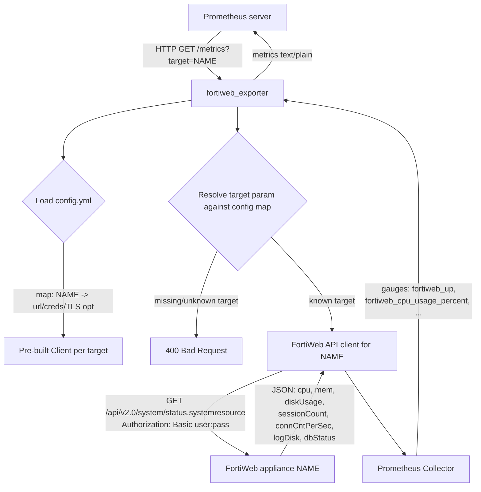
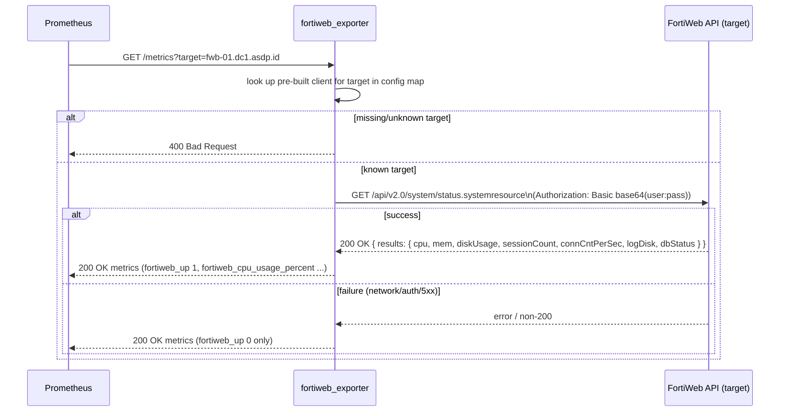

# Plan: FortiWeb Prometheus Exporter (basic system-resource metrics)

## Overview
Build a small Go binary that queries one or more FortiWeb appliances'
`api/v2.0/system/status.systemresource` REST endpoint and exposes CPU, memory, disk,
session, and connection-rate metrics on a `/metrics` HTTP endpoint. Each configured
appliance is scraped independently via a `target` query parameter
(`/metrics?target=fwb-01.dc1.asdp.id`), following the standard multi-target
Prometheus exporter pattern (the same one `blackbox_exporter`/`snmp_exporter` use).
Per-target connection details and credentials live in a `config.yml` file, keyed by
target name; auth is done with HTTP Basic Auth against the FortiWeb REST API.

> **Amendment (2026-09-18):** the original version of this plan (Tasks 1-9,
> already implemented) supported exactly one FortiWeb target with no `target` param.
> This amendment (Tasks 10-13) extends it to multiple targets, keyed by name in
> `config.yml`, selected per-scrape via `?target=`. See the updated Constraints/Scope
> below — "single target" is no longer a constraint.

### Flowchart


### Sequence


## Context
This is a brand-new, empty repository (`/home/ndkprd/devel/ndkprd/fortiweb_exporter`,
not yet a git repo) — there is no existing code, no prior plans, and no established
project conventions to follow. This plan establishes the initial structure from
scratch.

Reference for the FortiWeb REST API auth shape: the
[fortinet-ansible-dev FortiWeb Ansible collection](https://github.com/fortinet-ansible-dev/ansible-galaxy-fortiweb-collection)
authenticates to the FortiWeb REST API using the device admin username/password.
Per user decision below, this exporter uses **HTTP Basic Auth** (`Authorization: Basic
base64(username:password)`) on each request rather than the collection's
session-cookie + CSRF-token login flow, since FortiWeb's REST API supports Basic Auth
directly and it keeps the exporter fully stateless between scrapes.

FortiWeb appliances commonly run self-signed TLS certificates out of the box, so the
HTTP client must support an opt-in, config-driven `insecure_skip_verify` flag.

## Objective
Running `fortiweb_exporter --config config.yml` starts an HTTP server that:
1. Loads a map of named FortiWeb targets (each with URL, username, password, and
   TLS option) from `config.yml`.
2. On every `GET /metrics?target=NAME`, resolves `NAME` against the configured
   targets and calls that target's FortiWeb `system/status.systemresource` endpoint
   using HTTP Basic Auth. Requests with a missing or unrecognized `target` param get
   `400 Bad Request` instead of being silently ignored.
3. Exposes these Prometheus gauges (unlabeled — one target's values per scrape,
   Prometheus assigns the `instance` label via its own relabeling, same convention
   as `blackbox_exporter`'s `/probe`): `fortiweb_up`, `fortiweb_cpu_usage_percent`,
   `fortiweb_memory_usage_percent`, `fortiweb_disk_usage_percent`,
   `fortiweb_session_count`, `fortiweb_connections_per_second`,
   `fortiweb_log_disk_available`, `fortiweb_db_status_available`.
4. Degrades gracefully: if the FortiWeb API call fails, `/metrics?target=NAME` still
   returns `200 OK` with only `fortiweb_up 0` set (Prometheus's standard "target
   failed" convention), rather than erroring the whole scrape.

Done = `go build ./...` succeeds, `go test ./...` passes (including the FortiWeb
client and multi-target handler unit tests), a manually-run binary serves valid
Prometheus exposition format on `/metrics?target=NAME` for each configured target,
returns `400` for a missing/unknown target, and `docker build` produces a working
image.

## References
- No existing files — greenfield project. All paths below are new files this plan
  creates.
- `https://github.com/fortinet-ansible-dev/ansible-galaxy-fortiweb-collection` —
  reference for FortiWeb REST API username/password auth shape (used to validate the
  request/response contract, not copied directly since this plan uses Basic Auth
  instead of the collection's session+CSRF flow).
- `https://github.com/prometheus/client_golang` — official Prometheus Go
  instrumentation library, used for the collector and `/metrics` HTTP handler.

## Constraints / Scope

**In scope:**
- Multiple FortiWeb targets, configured as a `fortiweb: {name: {...}}` map in
  `config.yml`, each with its own URL/username/password/TLS option.
- A `target` query parameter on `/metrics` (`/metrics?target=NAME`) that selects
  which configured FortiWeb appliance to scrape for that request, matching the
  standard multi-target Prometheus exporter pattern.
- Only the `api/v2.0/system/status.systemresource` endpoint.
- HTTP Basic Auth against the FortiWeb REST API.
- Config-driven `insecure_skip_verify` TLS option (default `false`).
- On-demand query per scrape (no background poller/cache).
- `go.mod`-based Go module, `github.com/prometheus/client_golang` for metrics,
  `gopkg.in/yaml.v3` for config parsing.
- Sample `config.yml.example` + `README.md` documenting setup/build/run.
- `Dockerfile` for containerized builds.
- Unit tests for the FortiWeb API client (login/request + response parsing) using
  `net/http/httptest`.
- MIT `LICENSE` file.

**Out of scope:**
- Auto-discovery of FortiWeb targets (e.g. via file_sd, DNS, or a cloud API) —
  targets are only ever explicitly listed in `config.yml`.
- Any FortiWeb API endpoint other than `system/status.systemresource`.
- Session-cookie/CSRF-token auth flow (explicitly deferred in favor of Basic Auth).
- Background polling, caching, or configurable scrape intervals inside the exporter
  itself (Prometheus's own scrape_interval governs frequency).
- Metrics persistence, alerting rules, or Grafana dashboards.
- CI/CD pipeline setup, releases, or Helm charts.

**Non-negotiables:**
- Credentials (per-target username/password) must only ever be read from
  `config.yml`, never hardcoded or passed as CLI flags (avoids leaking secrets into
  shell history/process list).
- `/metrics?target=NAME` must never panic or return a non-200 due to the upstream
  FortiWeb call failing — failures must surface as `fortiweb_up 0`. A missing or
  unrecognized `target` param is the one case that *does* return non-200 (`400`),
  since that's a client request error, not a target-down condition.
- No secrets committed to the repo — `config.yml` (the real one, including any file
  containing real per-target credentials) must be gitignored; only
  `config.yml.example` with placeholder values is committed. Per-target credentials
  must never appear in logs or error messages (errors returned by the FortiWeb client
  must not echo the Authorization header or password).

## Tasks

### Task 1: Scaffold the Go module and project layout
- **Status**: completed
- **Date**: 2026-09-18
- **Related file**: `go.mod`, `.gitignore`, directory structure
- **Objective**: Initialize the Go module (`github.com/ndkprd/fortiweb_exporter`, Go
  1.22+), create the directory skeleton (`cmd/fortiweb_exporter/`,
  `internal/config/`, `internal/fortiweb/`, `internal/collector/`), and add a
  `.gitignore` that excludes `config.yml`, built binaries, and standard Go/OS cruft.
  Initialize git (`git init`) since the directory is not yet a repo.
- **Verification**: Run `go build ./...` from the repo root — no source files exist
  yet so it should succeed with no errors, and `test -f go.mod && git rev-parse
  --is-inside-work-tree` both succeed.

### Task 2: Implement config loading
- **Status**: completed
- **Date**: 2026-09-18
- **Related file**: `internal/config/config.go`, `internal/config/config_test.go`,
  `config.yml.example`
- **Objective**: Define a `Config` struct (fortiweb target URL, username, password,
  `insecure_skip_verify` bool, HTTP listen address, metrics path) and a
  `Load(path string) (*Config, error)` function that reads and parses YAML via
  `gopkg.in/yaml.v3`, applying sensible defaults (listen address `:9633`, metrics
  path `/metrics`) when omitted. Create `config.yml.example` with placeholder values
  matching the struct fields. *(depends on Task 1)*
- **Verification**: Run `go test ./internal/config/...` — a test loading
  `config.yml.example` (or an inline fixture) must assert the parsed struct fields
  match expected values, including that defaults apply when optional fields are
  omitted.

### Task 3: Implement the FortiWeb API client
- **Status**: completed
- **Date**: 2026-09-18
- **Related file**: `internal/fortiweb/client.go`
- **Objective**: Implement `fortiweb.Client` with a constructor taking base URL,
  username, password, and `insecureSkipVerify bool`. Add
  `GetSystemResourceStatus(ctx context.Context) (*SystemResourceStatus, error)` that
  issues `GET {baseURL}/api/v2.0/system/status.systemresource` with header
  `Authorization: Basic base64(username:password)`, and unmarshals the
  `{"results": {"cpu":..., "mem":..., "logDisk":..., "dbStatus":..., "diskUsage":...,
  "sessionCount":..., "connCntPerSec":...}}` envelope into a typed
  `SystemResourceStatus` struct (`CPU, Mem, DiskUsage float64`; `SessionCount int64`;
  `ConnCntPerSec int64`; `LogDisk, DBStatus string`). The underlying `http.Client`
  must use a `tls.Config{InsecureSkipVerify: insecureSkipVerify}` transport per the
  constructor flag. Non-2xx responses return a descriptive error. *(depends on
  Task 1)*
- **Verification**: `go build ./internal/fortiweb/...` succeeds and the package
  exports `Client`, `NewClient`, `SystemResourceStatus`, and
  `(*Client).GetSystemResourceStatus` (checkable via `go doc ./internal/fortiweb`).

### Task 4: Unit tests for the FortiWeb API client
- **Status**: completed
- **Date**: 2026-09-18
- **Related file**: `internal/fortiweb/client_test.go`
- **Objective**: Using `net/http/httptest.NewServer`, write tests that (a) assert the
  client sends the correct `Authorization: Basic ...` header and requests the
  correct path, (b) assert a well-formed JSON response is parsed into the expected
  `SystemResourceStatus` values matching the sample payload from this plan's
  Overview, and (c) assert a non-200 response (e.g. 401) surfaces as a non-nil error.
  *(depends on Task 3)*
- **Verification**: Run `go test ./internal/fortiweb/... -v` — all tests pass.

### Task 5: Implement the Prometheus collector
- **Status**: completed
- **Date**: 2026-09-18
- **Related file**: `internal/collector/collector.go`, `internal/collector/collector_test.go`
- **Objective**: Implement a `prometheus.Collector` that wraps a `fortiweb.Client`
  (accept it as/through a small interface so it's mockable). On `Collect`, call
  `GetSystemResourceStatus`; on success emit `fortiweb_up 1` plus gauges
  `fortiweb_cpu_usage_percent`, `fortiweb_memory_usage_percent`,
  `fortiweb_disk_usage_percent`, `fortiweb_session_count`,
  `fortiweb_connections_per_second`, and boolean-as-gauge
  `fortiweb_log_disk_available` / `fortiweb_db_status_available` (1 if the string
  value is `"Available"`, else 0). On failure, emit only `fortiweb_up 0` and log the
  error (do not panic or return an error from `Collect`). *(depends on Task 3)*
- **Verification**: Run `go test ./internal/collector/...` — a test using a fake
  client returning fixed `SystemResourceStatus` values, verified with
  `github.com/prometheus/client_golang/prometheus/testutil.CollectAndCompare`
  against an expected exposition-format fixture; a second test with a fake client
  returning an error asserts only `fortiweb_up 0` is emitted.

### Task 6: Wire up `main.go`
- **Status**: completed
- **Date**: 2026-09-18
- **Related file**: `cmd/fortiweb_exporter/main.go`
- **Objective**: Add a `--config` flag (default `config.yml`), load config via
  `internal/config`, construct the `fortiweb.Client` and collector, register the
  collector with a `prometheus.Registry`, and start an `http.Server` serving
  `promhttp.HandlerFor(registry, ...)` on the configured metrics path/address. Log
  startup info (listen address, target URL) to stdout. *(depends on Task 2, Task 5)*
- **Verification**: Run `go build -o /tmp/fortiweb_exporter ./cmd/fortiweb_exporter`
  — build succeeds. Then run it against a `config.yml` pointing at a throwaway
  `httptest`-style stub or an unreachable URL and `curl -s
  http://localhost:9633/metrics | grep fortiweb_up` — expect `fortiweb_up 0` (proves
  the server starts and degrades gracefully without a real device).

### Task 7: Add a Dockerfile
- **Status**: completed
- **Date**: 2026-09-18
- **Related file**: `Dockerfile`
- **Objective**: Write a multi-stage Dockerfile (Go build stage on
  `golang:1.22-alpine` or newer, minimal `gcr.io/distroless/static` or
  `alpine`-based final stage) that builds `cmd/fortiweb_exporter` and runs it as a
  non-root user, exposing the default metrics port. *(depends on Task 6)*
- **Verification**: Run `docker build -t fortiweb_exporter:test .` from the repo
  root — build succeeds and `docker run --rm fortiweb_exporter:test --help` (or
  equivalent) starts without a crash loop.

### Task 8: Write README.md
- **Status**: completed
- **Date**: 2026-09-18
- **Related file**: `README.md`
- **Objective**: Document what the exporter does, the exposed metric names/types,
  `config.yml` format (with reference to `config.yml.example`), how to build/run
  locally (`go build`, `go run`), how to build/run via Docker, and a sample
  `scrape_config` snippet for `prometheus.yml`. *(depends on Task 6, Task 7)*
- **Verification**: `grep -qE "^## (Configuration|Metrics|Usage|Docker)" README.md`
  succeeds for each of those section headers.

### Task 9: Add MIT LICENSE
- **Status**: completed
- **Date**: 2026-09-18
- **Related file**: `LICENSE`
- **Objective**: Add the standard MIT License text with the current year (2026) and
  copyright holder attributed to the repo owner.
- **Verification**: `grep -q "MIT License" LICENSE` succeeds.

## Amendment: multi-target support (2026-09-18)

Tasks 1-9 above shipped a single-target exporter. This amendment adds Tasks 10-13 to
support multiple FortiWeb targets, selected per-scrape via `?target=`, per the
updated Overview/Objective/Constraints above.

### Task 10: Change config to a multi-target map
- **Status**: completed
- **Date**: 2026-09-18
- **Related file**: `internal/config/config.go`, `internal/config/config_test.go`,
  `config.yml.example`
- **Objective**: Change `Config.FortiWeb` from a single `FortiWebConfig` to
  `map[string]FortiWebConfig`, keyed by an operator-chosen target name (e.g.
  `fwb-01.dc1.asdp.id`) — `FortiWebConfig` itself (`URL`, `Username`, `Password`,
  `InsecureSkipVerify`) is unchanged. Update `validate()` to: (a) return an error if
  the map is empty ("at least one fortiweb target must be configured"), and (b) for
  each entry, return an error naming the target key if its `URL`, `Username`, or
  `Password` is empty (e.g. `fmt.Errorf("target %q: url is required", name)`).
  Update `config.yml.example` to the map schema with two example targets using
  placeholder (non-real) values, matching this shape:
  ```yaml
  fortiweb:
    fwb-01.example.com:
      url: "https://10.0.1.10"
      username: "admin"
      password: "changeme"
      insecure_skip_verify: true
    fwb-02.example.com:
      url: "https://10.0.2.10"
      username: "admin"
      password: "changeme"
      insecure_skip_verify: true
  listen_address: ":9633"
  metrics_path: "/metrics"
  ```
  *(depends on Task 2 — modifies it in place; no dependency on Tasks 11-13)*
- **Verification**: Run `go test ./internal/config/...` — tests cover: a
  multi-target file parses into the expected `map[string]FortiWebConfig`; an empty
  `fortiweb:` map (or the key omitted) produces a non-nil `Load` error; a map with
  one valid and one invalid (missing password) target produces a non-nil error
  naming the invalid target's key.

### Task 11: Multi-target `/metrics` HTTP handler
- **Status**: completed
- **Date**: 2026-09-18
- **Related file**: `internal/handler/handler.go`, `internal/handler/handler_test.go`
- **Objective**: Add package `handler` with `NewMetricsHandler(clients
  map[string]collector.StatusGetter) http.Handler` (import
  `github.com/ndkprd/fortiweb_exporter/internal/collector` for the `StatusGetter`
  interface — `*fortiweb.Client` already satisfies it, so `main.go` passes in a
  pre-built `map[string]*fortiweb.Client` sourced from `Config.FortiWeb`, no new
  wrapper type needed). Its `ServeHTTP`:
  1. Reads `target := r.URL.Query().Get("target")`; if empty, `http.Error(w, "target
     parameter is required", http.StatusBadRequest)` and return.
  2. Looks up `target` in `clients`; if absent, `http.Error(w, fmt.Sprintf("unknown
     target %q", target), http.StatusBadRequest)` and return.
  3. Otherwise builds a fresh `prometheus.NewRegistry()`, registers
     `collector.NewCollector(client)`, and delegates to
     `promhttp.HandlerFor(registry, promhttp.HandlerOpts{}).ServeHTTP(w, r)` — a
     per-request registry (not a shared global one) so each target's scrape only
     ever contains that target's 8 gauges, matching `blackbox_exporter`'s `/probe`
     pattern. *(depends on Task 5's `collector.StatusGetter`/`collector.NewCollector`,
     already implemented; independent of Task 10)*
- **Verification**: Run `go test ./internal/handler/... -v` — tests (using a fake
  `collector.StatusGetter` and `httptest.NewRecorder`/`httptest.NewRequest`) cover:
  missing `target` param → `400`; unknown `target` → `400` with the target name in
  the body; known `target` → `200` with a body containing `fortiweb_up 1` (or `0` for
  a fake that errors) and none of another target's data.

### Task 12: Wire multi-target handler into `main.go`
- **Status**: completed
- **Date**: 2026-09-18
- **Related file**: `cmd/fortiweb_exporter/main.go`
- **Objective**: Replace the single global `prometheus.Registry` + `collector`
  wiring with: after `config.Load`, build `clients :=
  make(map[string]collector.StatusGetter, len(cfg.FortiWeb))` by calling
  `fortiweb.NewClient(fw.URL, fw.Username, fw.Password, fw.InsecureSkipVerify)` once
  per entry in `cfg.FortiWeb` (built once at startup, not per-request — `*http.Client`
  is safe for concurrent use, so no locking needed since the map is never mutated
  after startup); register `mux.Handle(cfg.MetricsPath,
  handler.NewMetricsHandler(clients))` instead of the old
  `promhttp.HandlerFor(...)` line. Startup log line should include the number of
  configured targets (e.g. `.Int("target_count", len(clients))`) rather than a single
  `fortiweb_target` URL field (which no longer makes sense for N targets).
  *(depends on Task 10, Task 11)*
- **Verification**: `go build -o /tmp/fortiweb_exporter ./cmd/fortiweb_exporter`
  succeeds. Run it against a `config.yml` with two targets (both pointing at
  unreachable addresses is fine) and:
  - `curl -s -o /dev/null -w '%{http_code}' http://localhost:9633/metrics` → `400`
    (no target param)
  - `curl -s -o /dev/null -w '%{http_code}' 'http://localhost:9633/metrics?target=nope'`
    → `400` (unknown target)
  - `curl -s 'http://localhost:9633/metrics?target=<first-configured-name>' | grep
    fortiweb_up` → `fortiweb_up 0` (degrades gracefully, same as before)

### Task 13: Update README and Dockerfile usage examples for multi-target
- **Status**: completed
- **Date**: 2026-09-18
- **Related file**: `README.md`
- **Objective**: Update the `## Configuration` section to document the
  `fortiweb: {name: {...}}` map schema (replacing the old single-target table), and
  the `## Usage` section to show `curl 'http://localhost:9633/metrics?target=NAME'`
  and a Prometheus `scrape_configs` example using the standard multi-target
  relabeling pattern:
  ```yaml
  scrape_configs:
    - job_name: fortiweb
      static_configs:
        - targets:
            - fwb-01.dc1.asdp.id
            - fwb-01.dc2.asdp.id
      relabel_configs:
        - source_labels: [__address__]
          target_label: __param_target
        - source_labels: [__param_target]
          target_label: instance
        - target_label: __address__
          replacement: fortiweb-exporter:9633
  ```
  No Dockerfile changes are needed (the handler change is entirely in application
  code), so just confirm the existing `docker run` example in `README.md` still
  reads correctly with the new `?target=` usage. *(depends on Task 12)*
- **Verification**: `grep -qE "^## Configuration" README.md && grep -qE "^##
  Usage" README.md && grep -q '?target=' README.md` all succeed.

## FAQ

1. **Is the FortiWeb `system/status.systemresource` JSON response shape confirmed?**
   The plan's Overview and Task 3 specify a flat envelope
   (`{"results": {"cpu", "mem", "diskUsage", "sessionCount", "connCntPerSec",
   "logDisk", "dbStatus"}}`) with `cpu`/`mem`/`diskUsage` as `float64` and
   `logDisk`/`dbStatus` as plain strings compared against `"Available"`. The only
   cited reference is the FortiWeb Ansible collection, which documents auth, not this
   endpoint's response body. Real FortiWeb firmware sometimes nests these values
   (e.g. per-core CPU arrays, or `mem`/`disk` as objects with multiple sub-fields)
   depending on version. Should I implement exactly the flat shape as literally
   specified in the plan (treating it as the authoritative contract for this task),
   with the understanding that it may need adjustment once tested against a real
   appliance? (Assumption if no answer: yes — implement the flat shape as specified.)

   **Answer:** Yes. Treat the flat shape as the authoritative contract for this
   plan — it's taken directly from a real response the user provided (see Q6's
   canonical fixture below), not a guess. If a real appliance later returns a
   different shape (nested per-core CPU, etc.), that's a follow-up plan, not a
   blocker here.

2. **Should the outbound FortiWeb API call have a request timeout?**
   Task 3/6 describe an on-demand call per scrape with graceful degradation to
   `fortiweb_up 0` on failure, but no timeout is specified for the HTTP client. Without
   one, a hung or slow FortiWeb device would block the `/metrics` handler
   indefinitely instead of degrading gracefully. Should the client use a fixed
   default timeout (e.g. 10s) via `http.Client{Timeout: ...}`, or should it be a
   configurable `config.yml` field? (Assumption if no answer: hardcode a reasonable
   default, e.g. 10s, on the `http.Client`.)

   **Answer:** Hardcode it — `http.Client{Timeout: 10 * time.Second}` in the
   `fortiweb.Client` constructor. Keep this plan's `config.yml` surface area minimal
   (per the original scope decision); a configurable timeout can be added later if
   it turns out to matter in practice.

3. **Should `config.Load` validate required fields?**
   Task 2 doesn't say whether `Load` should return an error when `target`,
   `username`, or `password` are missing/empty in `config.yml`, versus loading
   successfully with zero values and letting the first API call fail (surfacing as
   `fortiweb_up 0`). This affects both the config test in Task 2 and startup
   behavior in Task 6 (main.go exiting fast on a broken config vs. starting an
   always-down exporter). (Assumption if no answer: `Load` returns an error if
   `target`, `username`, or `password` is empty, since a config missing these can
   never succeed and failing fast at startup is more operable.)

   **Answer:** Confirmed — `Load` returns an error when `target`, `username`, or
   `password` is empty. Fail fast at startup rather than running an exporter that
   can never succeed.

4. **Should the target URL be normalized to avoid double slashes?**
   Task 3 builds the request URL as `{baseURL}/api/v2.0/system/status.systemresource`.
   If a user's `config.yml` sets `target: https://fw.example.com/` (trailing slash),
   naive concatenation produces `.../fw.example.com//api/v2.0/...`. Should the
   client/config trim a trailing slash from the configured target before use?
   (Assumption if no answer: yes — trim any trailing `/` from the configured target
   URL before building the request path.)

   **Answer:** Confirmed — trim any trailing `/` from the configured target URL
   (do it once in `fortiweb.NewClient`, so it's normalized regardless of caller).

5. **Who is the copyright holder for the MIT `LICENSE`?**
   Task 9 says to attribute the copyright line to "the repo owner" but doesn't name
   them. The module path uses GitHub handle `ndkprd`. Should the `LICENSE` copyright
   line use that handle, a real name, or something else? (Assumption if no answer:
   use `ndkprd` as the copyright holder, matching the `go.mod` module path owner.)

   **Answer:** Use `ndkprd` as the copyright holder name in `LICENSE`.

6. **Task 4 references "the sample payload from this plan's Overview" — but the Overview has no concrete example values.**
   The Overview's flowchart/sequence diagrams list field *names* only (`cpu, mem,
   diskUsage, sessionCount, connCntPerSec, logDisk, dbStatus`), not example values.
   Task 4's verification implies a specific fixture to match against. Since none
   exists, I'll author a representative fixture (e.g. `cpu: 12.5, mem: 45.2,
   diskUsage: 10.1, sessionCount: 100, connCntPerSec: 5, logDisk: "Available",
   dbStatus: "Available"`) for the client and collector tests unless told otherwise.

   **Answer:** Use the exact sample the user provided as the canonical fixture
   across Task 3/4/5 tests, rather than inventing new values:
   ```json
   {
     "results": {
       "cpu": 17,
       "mem": 78,
       "logDisk": "Available",
       "dbStatus": "Available",
       "diskUsage": 79,
       "sessionCount": 21051,
       "connCntPerSec": 482
     }
   }
   ```
   These integers unmarshal cleanly into the `float64`/`int64` struct fields
   specified in Task 3 — no shape change needed.
