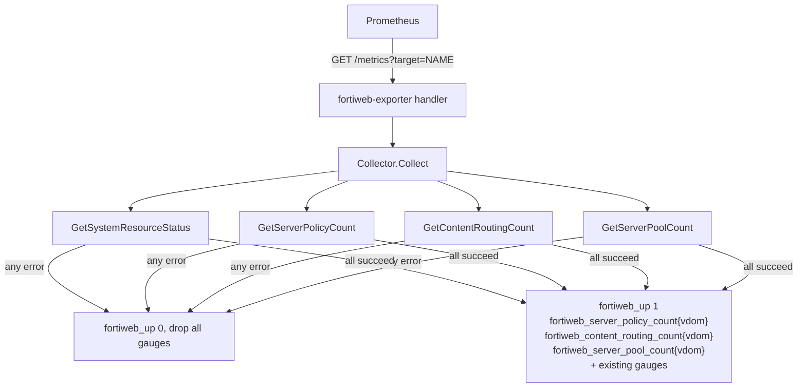
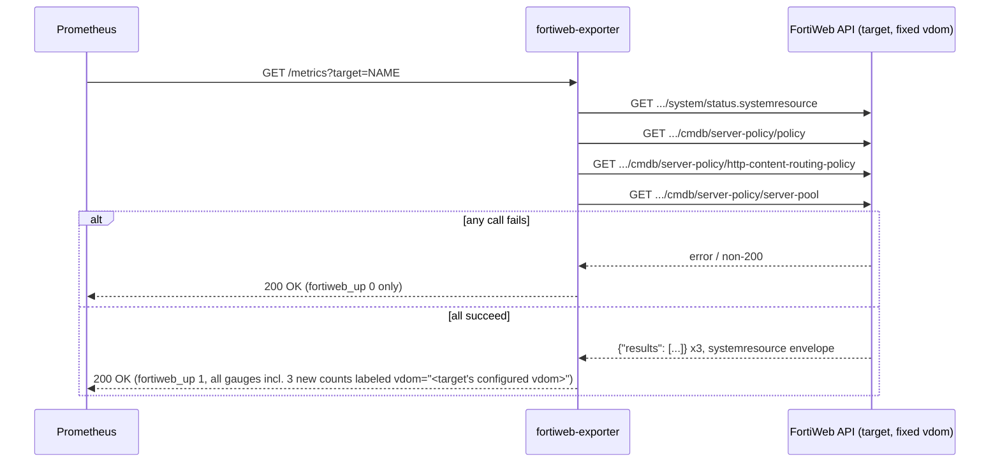

# Plan: Add per-vdom resource-count metrics (server-policy, content-routing, server-pool, protection-profile, allowed-hosts, virtual-server, signature)

## Overview
Add Prometheus gauges to the exporter reporting the current number of configured
FortiWeb objects per resource type, per vdom. Each configured target is already
pinned to exactly one vdom (`config.yml`'s `vdom` field, baked into the auth
header) — no cross-vdom enumeration is added; the new gauges are labeled with
that target's own configured vdom so a Prometheus query spanning multiple
targets/vdoms can still distinguish them.

Original scope (Tasks 1-4, completed): `server-policy`, `content-routing`,
`server-pool`.

Amendment scope (Tasks 5-7): `protection-profile`, `allowed-hosts`,
`virtual-server`, `signature` — same pattern, same all-or-nothing/vdom-label
design, just 4 more resource types reusing the Task 1/2 architecture
(`getResourceCount` helper, `resourceListEnvelope`, `StatusGetter` interface,
per-vdom gauge labeling).

### Flowchart


### Sequence


## Context
Current architecture (`internal/fortiweb/client.go`, `internal/collector/collector.go`):
- One `fortiweb.Client` = one FortiWeb appliance + one vdom, baked into the
  `Authorization` header payload (`{"username","password","vdom"}`) at construction
  time (`config.FortiWebConfig.VDOM`, defaulting to `"root"`).
- `Collector` wraps a `StatusGetter` (currently just
  `GetSystemResourceStatus(ctx) (*SystemResourceStatus, error)`) and emits gauges on
  `Collect()`. On any upstream error it emits only `fortiweb_up 0` and returns — an
  all-or-nothing convention.
- No vdom-enumeration API exists anywhere in the FortiWeb API notes
  (`/home/ndkprd/devel/itops/arahin/.agents/refs/fortiweb_api.md`) — confirmed by
  grep; the only way the exporter knows about a vdom is the one baked into its own
  config per target.
- The 3 new resource types' "Get List" endpoints
  (`/api/v2.0/cmdb/server-policy/policy`,
  `/api/v2.0/cmdb/server-policy/http-content-routing-policy`,
  `/api/v2.0/cmdb/server-policy/server-pool`) have no confirmed sample response in
  the notes for these exact paths, but every other FortiWeb "Get List" endpoint
  documented there (e.g. `vserver/vip-list`) returns `{"results": [...]}` — a JSON
  array. Per user decision, count = `len(results)`, same assumption applied here.

## Objective
`go build ./...` succeeds and `go test ./...` passes with:
1. `fortiweb.Client` gains 3 new methods —
   `GetServerPolicyCount(ctx) (int, error)`,
   `GetContentRoutingCount(ctx) (int, error)`,
   `GetServerPoolCount(ctx) (int, error)` — each `GET`-ing its endpoint and
   returning `len(results)` from a `{"results": [...]}` envelope.
2. `collector.Collector` emits 3 new gauges on every successful scrape:
   `fortiweb_server_policy_count{vdom="<configured vdom>"}`,
   `fortiweb_content_routing_count{vdom="<configured vdom>"}`,
   `fortiweb_server_pool_count{vdom="<configured vdom>"}`. If any of the 4 upstream
   calls (existing system-status call + these 3 new ones) fails, the scrape
   degrades to `fortiweb_up 0` only — same all-or-nothing convention as today, no
   partial degrade.
3. `README.md`'s metrics list documents the 3 new gauges.
4. A manually-run binary against a config with an unreachable target still returns
   `200 OK` with `fortiweb_up 0` (regression check on the all-or-nothing failure
   path), and a fake/stub-backed test confirms the 3 new gauges appear with the
   correct `vdom` label value on success.

## References
- `internal/fortiweb/client.go` — add the 3 new `Get*Count` methods here, following
  the existing `GetSystemResourceStatus`/`doStatusRequest` pattern (envelope struct,
  `authHeaderValue()`, non-2xx error handling via `readSnippet`).
- `internal/fortiweb/client_test.go` — add matching `httptest`-backed tests.
- `internal/collector/collector.go` — extend `StatusGetter` interface with the 3 new
  methods, add 3 `*prometheus.Desc` fields (each with `variableLabels: []string{"vdom"}`),
  add a `vdom string` field/param so `Collect()` can label the new gauges, update
  `NewCollector` signature to accept it, update `Collect`/`collectStatus` to call the
  3 new methods and emit gauges (or degrade to `fortiweb_up 0` on any error).
- `internal/collector/collector_test.go` — extend the fake `StatusGetter` and
  exposition-format fixtures for the 3 new gauges (success + failure cases).
- `cmd/fortiweb-exporter/main.go` — update the `NewCollector(...)` call site to pass
  each target's `target.VDOM` string alongside the client.
- `README.md` — add the 3 new metric names to the existing metrics documentation
  section.
- `/home/ndkprd/devel/itops/arahin/.agents/refs/fortiweb_api.md` — source of the 3
  endpoint paths and the `{"results":[...]}` envelope pattern (via the analogous
  `vip-list` example; not a byte-exact confirmed sample for these 3 endpoints).
- `.agents/plans/001-fortiweb-basic-exporter.md` — prior plan establishing the
  client/collector/config architecture this plan extends; not superseded.

## Constraints / Scope

**In scope:**
- 3 new gauges: `fortiweb_server_policy_count`, `fortiweb_content_routing_count`,
  `fortiweb_server_pool_count`, each labeled `vdom` with the target's own configured
  vdom value (no other new labels).
- 3 new `fortiweb.Client` methods, one GET call each, count via `len(results)`.
- All-or-nothing failure convention (matches existing `Collect()` behavior).
- Updating `README.md`'s metrics section.

**Out of scope:**
- Cross-vdom enumeration / multi-vdom-per-target support (no discovery API exists;
  explicitly rejected per user decision).
- Grafana dashboard panel changes in `examples/` (not requested).
- Any endpoint other than the 3 named "Get List" calls (no detail/create/update
  calls needed — this is read-only counting).
- Partial-degrade failure handling (rejected in favor of all-or-nothing).
- Caching/memoizing counts across scrapes (matches existing on-demand-per-scrape
  design).

**Non-negotiables:**
- No secrets/credentials logged or echoed in errors (same rule as existing client
  code — `readSnippet` truncation, no header/password echoing).
- `/metrics?target=NAME` must never panic; upstream failures must surface as
  `fortiweb_up 0`, never a 5xx from the exporter itself.

## Tasks

### Task 1: Add 3 resource-count client methods
- **Status**: completed
- **Date**: 2026-09-18
- **Related file**: `internal/fortiweb/client.go`, `internal/fortiweb/client_test.go`
- **Objective**: Add a `resourceListEnvelope` (or reuse a generic
  `struct{ Results []json.RawMessage }`) type and 3 public methods —
  `GetServerPolicyCount`, `GetContentRoutingCount`, `GetServerPoolCount` — each
  issuing `GET {baseURL}<endpoint>` with the existing `Authorization` header scheme,
  decoding `{"results":[...]}`, and returning `len(results)`. Endpoints:
  `/api/v2.0/cmdb/server-policy/policy`,
  `/api/v2.0/cmdb/server-policy/http-content-routing-policy`,
  `/api/v2.0/cmdb/server-policy/server-pool`. Non-2xx responses return a descriptive
  error via the existing `readSnippet` helper, matching `GetSystemResourceStatus`'s
  error style.
- **Verification**: `go test ./internal/fortiweb/... -v` passes, with new tests
  (via `httptest.NewServer`) asserting: correct path requested per method, a
  well-formed `{"results":[{}, {}, {}]}` fixture returns count `3`, and a non-200
  response surfaces a non-nil error.

### Task 2: Extend the collector with the 3 new gauges *(depends on Task 1)*
- **Status**: completed
- **Date**: 2026-09-18
- **Related file**: `internal/collector/collector.go`, `internal/collector/collector_test.go`
- **Objective**: Extend `StatusGetter` with the 3 new method signatures. Add a
  `vdom string` parameter to `NewCollector(client StatusGetter, vdom string) *Collector`
  and store it. Add 3 `*prometheus.Desc` fields — `serverPolicyCount`,
  `contentRoutingCount`, `serverPoolCount` — each built with
  `variableLabels: []string{"vdom"}`. In `Collect()`, after the existing
  `GetSystemResourceStatus` call succeeds, call the 3 new methods; if any fails,
  degrade to `fortiweb_up 0` only (same early-return convention already used for the
  system-status call). On full success, emit all existing gauges plus the 3 new
  ones via `prometheus.MustNewConstMetric(desc, prometheus.GaugeValue, float64(count), c.vdom)`.
  Update `Describe()` to include the 3 new Descs.
- **Verification**: `go test ./internal/collector/... -v` passes, with
  `testutil.CollectAndCompare` fixtures covering: (a) all 4 fake calls succeed →
  exposition text includes
  `fortiweb_server_policy_count{vdom="root"} 3` (or similar) for all 3 new metrics
  with the expected label value; (b) any one of the 3 new fake calls returning an
  error → only `fortiweb_up 0` is emitted, matching existing failure-path test
  style.

### Task 3: Wire the target's vdom into `NewCollector` at request time *(depends on Task 2)*
- **Status**: completed
- **Date**: 2026-09-18
- **Related file**: `cmd/fortiweb-exporter/main.go`, `internal/handler/probe.go`,
  `internal/handler/probe_test.go`
- **Objective**: `NewCollector(...)` is actually called per-request inside
  `probe.go`'s `ServeHTTP` (not in `main.go`), against the `clients` map built in
  `main.go` and passed into `handler.NewProbeHandler`. Since `Collector` now needs a
  per-target `vdom` string too, add a small struct in package `handler`:
  ```go
  type Target struct {
      Client collector.StatusGetter
      VDOM   string
  }
  ```
  Change `NewProbeHandler` to accept `map[string]Target` instead of
  `map[string]collector.StatusGetter`; update `ServeHTTP` to read `t.Client`/`t.VDOM`
  and call `collector.NewCollector(t.Client, t.VDOM)`. Update `main.go` to build
  `map[string]handler.Target{Client: fortiweb.NewClient(...), VDOM: target.VDOM}`
  per entry instead of the bare `StatusGetter` map. Update `probe_test.go`'s local
  `fakeStatusGetter` to implement the 3 new `StatusGetter` methods (Task 2) so
  `internal/handler` still compiles/tests pass.
- **Verification**: `go build -o /tmp/fortiweb-exporter ./cmd/fortiweb-exporter`
  succeeds. `go test ./internal/handler/...` passes. Run the binary against a
  `config.yml` with a target whose `vdom: "development"` pointing at an unreachable
  address; `curl -s 'http://localhost:9633/metrics?target=<name>' | grep
  fortiweb_up` shows `fortiweb_up 0` (regression: all-or-nothing path still works
  after the signature change).

### Task 4: Document the 3 new metrics in README
- **Status**: completed
- **Date**: 2026-09-18
- **Related file**: `README.md`
- **Objective**: Add `fortiweb_server_policy_count`, `fortiweb_content_routing_count`,
  and `fortiweb_server_pool_count` (each noting the `vdom` label) to the existing
  metrics documentation section, alongside the already-documented gauges.
- **Verification**: `grep -c "fortiweb_server_policy_count\|fortiweb_content_routing_count\|fortiweb_server_pool_count" README.md` returns `3` (or more, if mentioned in
  multiple places).

## Amendment: 4 more resource types (2026-09-18)

Adds `protection-profile`, `allowed-hosts`, `virtual-server`, and `signature`
resource-count gauges, reusing the Task 1/2 architecture exactly (no new design
decisions — same all-or-nothing failure mode, same `vdom` label, same shared
`resourceListEnvelope`/`getResourceCount` helper). Endpoints (from
`/home/ndkprd/devel/itops/arahin/.agents/refs/fortiweb_api.md`):

| Resource | Endpoint |
|---|---|
| `protection-profile` | `GET /api/v2.0/cmdb/waf/web-protection-profile.inline-protection` |
| `allowed-hosts` | `GET /api/v2.0/cmdb/server-policy/allow-hosts` |
| `virtual-server` | `GET /api/v2.0/cmdb/server-policy/vserver` |
| `signature` | `GET /api/v2.0/cmdb/waf/signature` |

`allowed-hosts` and `virtual-server`/`signature` "Get List" endpoints have no
confirmed sample JSON in the refs (same assumption as the original 3: `Get List`
returns `{"results":[...]}`, count = `len(results)`). `protection-profile`'s
refs entry only shows a `Get Detail` (with `mkey`) sample, which is a *flat
object* (`{"results": {...}}`), not a list — but `Get List` (no `mkey`) is
assumed to follow the same list convention as every other resource type, per
the same accepted assumption already used for the original 3 resources.

### Task 5: Add 4 resource-count client methods *(depends on Task 1)*
- **Status**: completed
- **Date**: 2026-09-18
- **Related file**: `internal/fortiweb/client.go`, `internal/fortiweb/client_test.go`
- **Objective**: Add 4 more path constants and public methods on `fortiweb.Client`
  — `GetProtectionProfileCount`, `GetAllowedHostsCount`, `GetVirtualServerCount`,
  `GetSignatureCount` — each a thin wrapper around the existing
  `getResourceCount(ctx, path)` helper (same as `GetServerPolicyCount` etc.), using
  the endpoints in the table above. No new envelope type needed —
  `resourceListEnvelope` is reused as-is.
- **Verification**: `go test ./internal/fortiweb/... -v` passes, extending
  `TestResourceCountMethods`'s table with the 4 new methods/paths (same
  `{"results":[{},{},{}]}` → count `3` fixture, plus path assertions).

### Task 6: Extend the collector with the 4 new gauges *(depends on Task 5, Task 2)*
- **Status**: completed
- **Date**: 2026-09-18
- **Related file**: `internal/collector/collector.go`, `internal/collector/collector_test.go`
- **Objective**: Extend `StatusGetter` with the 4 new method signatures. Add 4 more
  `*prometheus.Desc` fields (`variableLabels: []string{"vdom"}`):
  `fortiweb_protection_profile_count`, `fortiweb_allowed_hosts_count`,
  `fortiweb_virtual_server_count`, `fortiweb_signature_count`. In `Collect()`, call
  the 4 new methods after the existing ones; any failure degrades to
  `fortiweb_up 0` only (same all-or-nothing convention, no partial degrade). Update
  `Describe()` accordingly.
- **Verification**: `go test ./internal/collector/... -v` passes — extend the fake
  `StatusGetter` and the `TestCollect_Success`/`TestCollect_ResourceCountFailure`
  fixtures to cover all 4 new gauges/labels.

### Task 7: Wire the fake in `internal/handler` + document in README *(depends on Task 6)*
- **Status**: completed
- **Date**: 2026-09-18
- **Related file**: `internal/handler/probe_test.go`, `README.md`
- **Objective**: Extend `probe_test.go`'s local `fakeStatusGetter` with the 4 new
  `StatusGetter` methods (compile requirement, same as Task 3's fake update for the
  original 3). Add the 4 new metric names (each noting the `vdom` label) to
  `README.md`'s `## Metrics` table.
- **Verification**: `go test ./internal/handler/...` passes. `grep -c
  "fortiweb_protection_profile_count\|fortiweb_allowed_hosts_count\|fortiweb_virtual_server_count\|fortiweb_signature_count"
  README.md` returns `4` (or more).

## FAQ

1. **Task 3's file list only names `cmd/fortiweb-exporter/main.go`, but `NewCollector(...)` is actually called inside `internal/handler/probe.go`'s `ServeHTTP`, per request — not in `main.go`.** Today `main.go` only builds `clients := make(map[string]collector.StatusGetter, ...)` and hands that map straight to `handler.NewProbeHandler(clients)`; `probe.go` does `registry.MustRegister(collector.NewCollector(client))` where `client` is the map's `StatusGetter` value. `main.go` never calls `NewCollector` itself. Is `internal/handler/probe.go` (and its constructor `NewProbeHandler`) explicitly in scope for Task 3, since that's where the vdom actually needs to reach `NewCollector`? Should I add it as a related file for this task?

   **Answer:** Yes — `internal/handler/probe.go` and `internal/handler/probe_test.go`
   are both in scope for Task 3 (added to its related-file list below). `main.go`
   still changes too (it builds the `clients` map passed into `NewProbeHandler`),
   but the actual `NewCollector(...)` call site being restructured lives in
   `probe.go`, not `main.go`.

2. **What shape should the vdom plumbing take through `main.go` → `handler.NewProbeHandler` → `probe.go`'s `ServeHTTP`?** The `clients` map is currently `map[string]collector.StatusGetter` (interface-only, no vdom). To pass `target.VDOM` through to each per-request `NewCollector` call, the map's value type needs to carry both the `StatusGetter` and its vdom. Options, none specified by the plan:
   - (a) change the map value to a small struct (e.g. `type Target struct { Client StatusGetter; VDOM string }` — in which package, `handler` or `collector`?) and update `NewProbeHandler(clients map[string]Target)` plus `probe.go`'s `ServeHTTP` to read `.Client`/`.VDOM`;
   - (b) keep `map[string]collector.StatusGetter` for clients and add a second parallel `map[string]string` of vdoms passed alongside into `NewProbeHandler`;
   - (c) something else (e.g. wrap `*collector.Collector` construction earlier and store pre-built collectors in the map instead of raw `StatusGetter`, changing `ServeHTTP` to just `registry.MustRegister(h.collectors[target])`).
   Which do you want?

   **Answer:** (a) — small struct, defined in package `handler` (that's the
   package that owns the `clients` map's wiring):
   ```go
   type Target struct {
       Client collector.StatusGetter
       VDOM   string
   }
   ```
   `main.go` builds `map[string]handler.Target` instead of
   `map[string]collector.StatusGetter`; `NewProbeHandler(targets map[string]handler.Target)`;
   `probe.go`'s `ServeHTTP` reads `t.Client`/`t.VDOM` and calls
   `collector.NewCollector(t.Client, t.VDOM)`. Minimal diff, no pre-built-collector
   caching (keeps the existing on-demand-per-scrape design from plan 001).

3. **`internal/handler/probe_test.go` declares its own local `fakeStatusGetter` implementing only `GetSystemResourceStatus`, and isn't listed as a related file anywhere in the plan.** Once `StatusGetter` gains the 3 new methods (Task 2), this fake will no longer satisfy the interface and `internal/handler` tests will fail to compile. Confirm `internal/handler/probe_test.go` needs updating too (presumably as part of Task 2 or Task 3) — should its fake also be extended, or would you rather it be consolidated with `collector_test.go`'s fake somehow?

   **Answer:** Update `probe_test.go`'s local `fakeStatusGetter` (as part of Task 3,
   since that's the task touching `probe.go`) to implement the 3 new interface
   methods too. Keep it separate from `collector_test.go`'s fake — two small
   per-package fakes is within the repo's "duplicate up to 2, then extract" norm,
   not worth a shared-fake abstraction for this.

4. **Task 1 says "add a `resourceListEnvelope` (or reuse a generic `struct{ Results []json.RawMessage }`)".** Confirm the intent is one single shared envelope type (e.g. `type resourceListEnvelope struct { Results []json.RawMessage }`) reused by decoding all 3 endpoints' responses (each method just does `len(envelope.Results)`), rather than 3 separate named envelope types — i.e. only the endpoint path and method name differ between `GetServerPolicyCount`/`GetContentRoutingCount`/`GetServerPoolCount`, not the decode logic.

   **Answer:** Confirmed — one shared `resourceListEnvelope{ Results []json.RawMessage }`
   type, decoded identically by all 3 methods; each method differs only in the
   endpoint path string and its own name (a shared private helper
   `func (c *Client) getResourceCount(ctx context.Context, path string) (int, error)`
   is fine internally, with the 3 public methods as thin wrappers calling it —
   this doesn't reopen the "3 named methods vs. 1 generic public method" decision,
   since the public API surface is still the 3 named methods).
